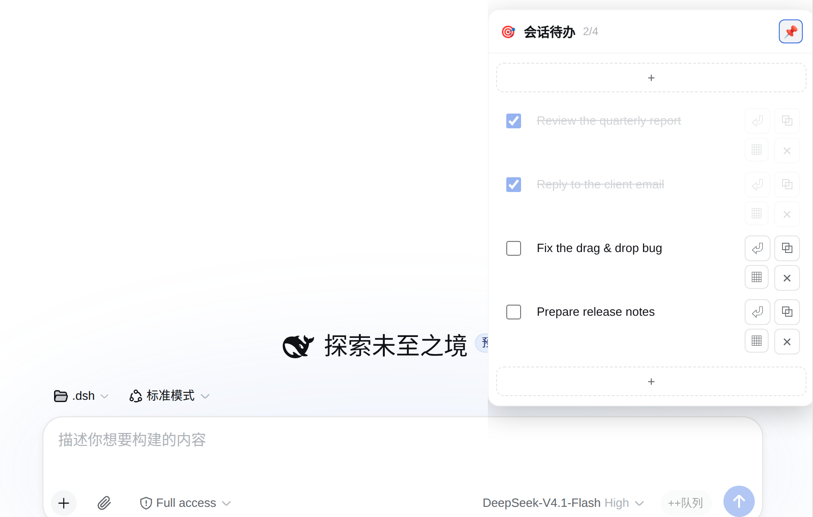

# dsh-session-todos

A session-scoped todo plugin for [DeepSeek Harness](https://github.com/deepseek-ai) (DSH).
It adds a **floating todo panel** to the top-right of the chat window, stores todos
**on the server** (so they follow you across devices), and marks sessions that still
have open tasks with a **🎯 badge** in the sidebar.

Pure plugin — no DSH source code is modified.

<p align="center">
  
</p>

## Features

- **Floating todo panel** (top-right of the chat window), collapsible to a single 🎯
  icon with a smooth slide in/out animation.
- **Per-task controls**
  - checkbox — check/uncheck persists immediately
  - multi-line text — long tasks wrap; **double-click** to edit inline (a
    multi-line `<textarea>` that auto-grows); `Enter` commits, `Shift+Enter` adds a newline
  - push-to-composer — append the task text to the message input
  - delete — with a confirmation dialog
  - **long-press and drag** to reorder — the dragged row follows your finger and
    live-previews the drop position
- **Header** shows a 🎯 icon and a `done/total` counter (e.g. `2/4`).
- **Mobile friendly** — tapping outside the panel auto-collapses it.
- **Server-side, cross-device storage** — one JSON file per session under
  `~/.dsh/dsh-session-todos/`, so the same list is available from any device signed
  in to the same DSH instance.
- **Session-list badge** — sessions with unfinished todos show a 🎯 icon on the left
  in the sidebar; it appears/disappears as you check tasks.

## Requirements

- DeepSeek Harness (DSH) Web app — the plugin is a **bundle plugin** (host + client halves).

## Install

The plugin is a DSH bundle plugin. Install it into a profile (e.g. `web`), then
restart the DSH web service (or refresh the browser once it is loaded):

```bash
# from a local path (wherever you cloned/placed the repo)
dshpm install /absolute/path/to/dsh-session-todos --profile web
# or, from a git URL:
# dshpm install https://github.com/seeingrain/dsh-session-todos.git --profile web
```

After the web service restarts, hard-refresh the browser (`Ctrl+Shift+R`).

## Usage

Open a session and click the 🎯 icon at the top-right of the chat window to expand
the panel.

- Click **+** at the bottom to create a task.
- **Double-click** a task's text to edit it (a multi-line textarea appears and grows
  with the content). `Enter` saves, `Esc` cancels, `Shift+Enter` inserts a newline.
- Check the box to mark a task done (the text is greyed out and its buttons are
  disabled).
- Use the **↗** button to append the task text to the message composer.
- Use the **🗑** button to delete (a confirmation is shown).
- **Press and hold** a task's text, then drag up/down to reorder; release to commit.
- The **→** button collapses the panel back to the 🎯 icon.
- On touch devices, tapping anywhere outside the panel collapses it.

## How it works

The plugin is split into a host half and a client half, both self-contained.

### Host half (`lib/index.js`)

Registers a route on the DSH `webServer` and persists todos as JSON files:

- `POST /dsh-session-todos/api/get` — `{ sessionId }` → `{ tasks }`
- `POST /dsh-session-todos/api/save` — `{ sessionId, tasks }` → saves + returns the normalized list
- `POST /dsh-session-todos/api/summary` — returns `{ sessions: [{ sessionId, hasUnfinished }] }`

Storage directory: `~/.dsh/dsh-session-todos/<sessionId>.json` (created on first write).

### Client half (`lib/client.js`)

- The floating panel is mounted on the `shell.overlay` slot and anchored to the chat
  area's `[data-conversation-scroll]`.
- Pushing a task to the composer uses the official input facade
  (`conversation.input` → `setDraft`), appending to any existing draft.
- The session-list badge is injected **without touching DSH source**: it locates
  session rows with `[role="treeitem"]`, reads each session's id from the React 18
  fiber, and injects/removes the 🎯 badge based on the todo state. If the fiber shape
  ever changes, it degrades gracefully (the badge simply does not render).

## Storage schema

```json
{
  "version": 1,
  "sessionId": "session-…",
  "updatedAt": 1787992050268,
  "tasks": [
    { "id": "t-…", "text": "…", "done": false, "createdAt": 1787992050268, "updatedAt": 1787992050268 }
  ]
}
```

## Notes / limitations

- The panel's collapsed/expanded state is remembered in `localStorage` (not synced
  across devices).
- The session-row badge relies on React 18 internal fiber metadata; on a future major
  React/DSH upgrade it may need re-testing (it degrades gracefully rather than breaking).
- The storage path lives under the DSH home directory (`~/.dsh`).

## License

[MIT](LICENSE)
